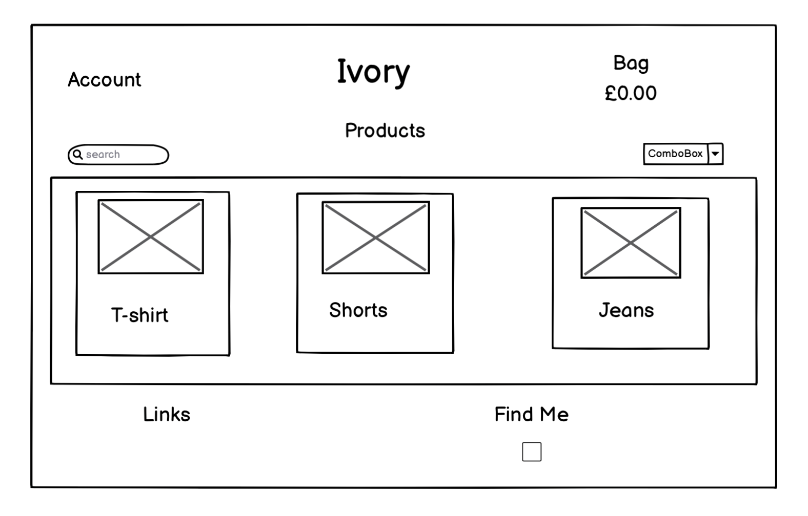
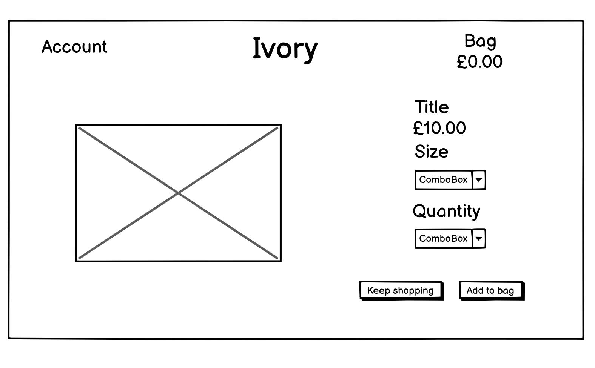
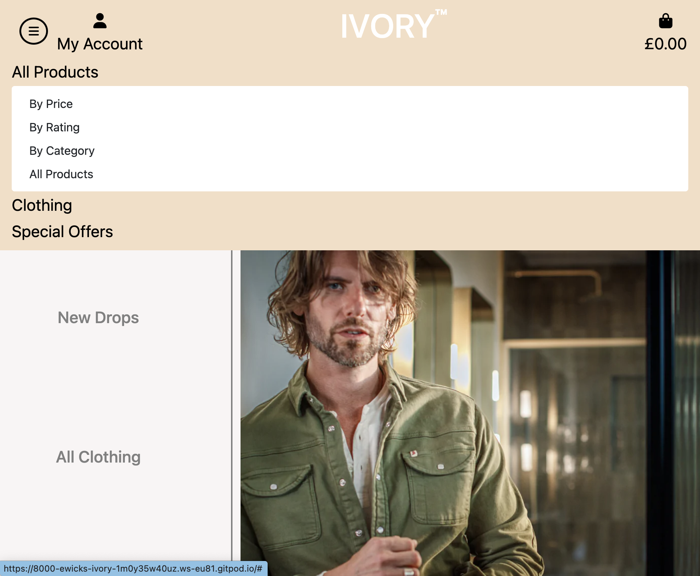
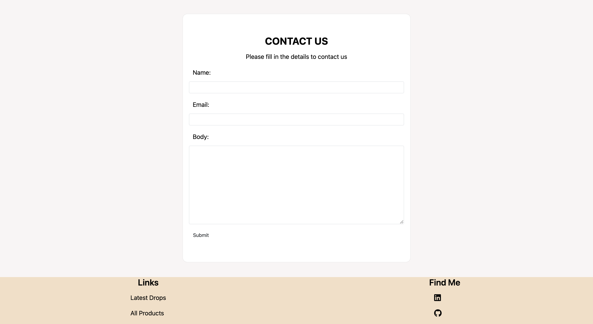
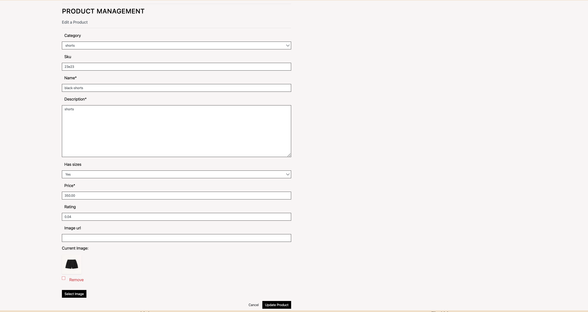
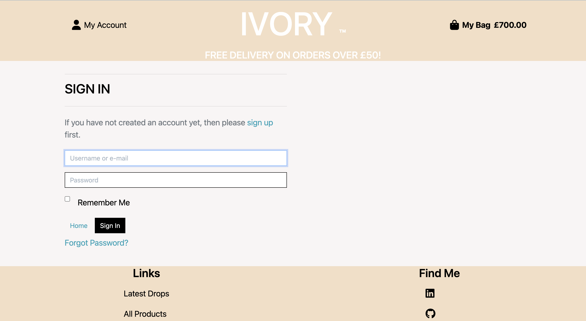
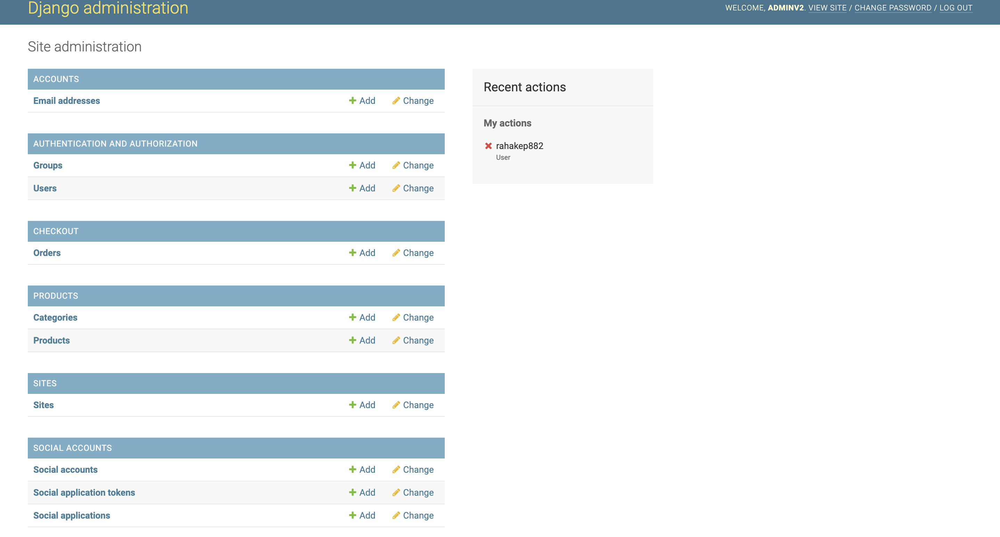
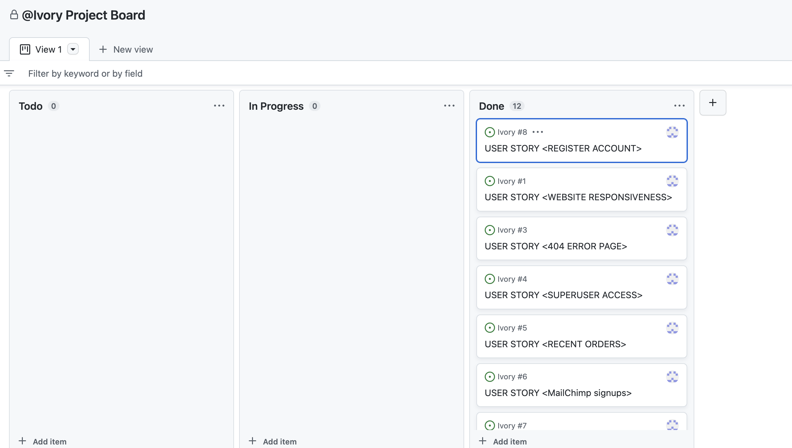
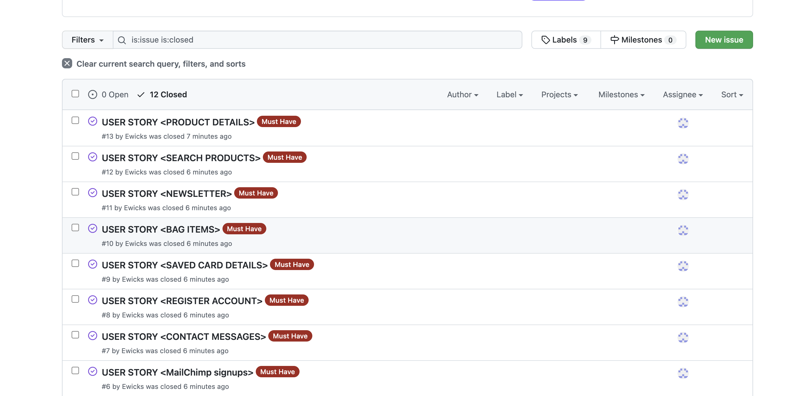

# Universal Blogs

## Introduction

Ivory is a modern clothing brand that is selling there stock via their online shop.

This website is for educational purposes only, the website is not setup to receive real payments, only fake payments are viable. 
To make a fake payment use the below credit card detials.


* 4242424242424242 (Visa)
* Expiration date = Any future date (Example: 12/24)
* CVN = any 3 digits (Example: 132)
* Postcode = any 5 digits (Example: 12345)


## Preview


### Live Website
To visit the deployed website click [here](https://ivory-e-commerce.herokuapp.com/)


# Table of Contents
- [Table of Contents](#table-of-contents)
- [Introduction](#introduction)
- [UX](#ux-user-experience)
- [Agile Development Process](#agile-development-process)
- [Design](#design)
- [Features](#features)
- [Technologies Used](#technologies-used)
- [Testing](#testing)
- [Deployment](#deployment)
- [Credits](#credits)
- [Acknowledgements](#acknowledgements)


## UX

This website was desgined to have an old fashioned, relic feel to it. The simplicity and use of colors were used to create this.

### Colour Scheme

Explain your colours and the colour scheme.

- `#000` used for primary text.
- `#f4dec5` used for the secondary background color
- `#F8F5F5` used for the main background color

### Typography

I used the Roboto font, via fonts.google.com, becuase it had a basic feel to it which corresponds with the design of the website. This is a popular font thats used in many projects. I also used the bag,profile, linkedin and github icons from font awesome so the page has less text and more images which makes the site easier to navigate.


- [Roboto](https://fonts.google.com/specimen/Montserrat) was used and the boldness varies where appropriate.


- [Font Awesome](https://fontawesome.com) icons were used throughout the site.

### User Stories

### Site Admin/Creator:

- As a Superuser I can delete, edit or add posts to the website. All other user's do not have this access. [#4](https://github.com/Ewicks/Ivory/issues/4)

- - As a Administrator I want to be able to view newsletter signups in the admin panel. [#6](https://github.com/Ewicks/Ivory/issues/6)

- - As a Administrator I can view the messages that a user has sent via the contact us form so that I can get back to them answering queries they may have. [#7](https://github.com/Ewicks/Ivory/issues/7)

### Site User

- As a Site User, I can access the site on differing devices, so I can interact with content on my preferred device. [#1](https://github.com/Ewicks/Ivory/issues/1)

- As a Site User i can press the back button if I get a 404 error page so that I can easily go back to the website. [#3](https://github.com/Ewicks/Ivory/issues/3)

- As a Site User, I can view my recent orders, so I can quickly check all the items that was ordered were the correct ones. [#5](https://github.com/Ewicks/Ivory/issues/5)

- As a Site User I want to be able to register for a newsletter. [#11](https://github.com/Ewicks/Ivory/issues/11)

- As a Site User, I can learn view the product up close, so that I can make an informed decision to purchase. [#13](https://github.com/Ewicks/Ivory/issues/13)

- As a Site User, I can search for products by entering descriptive words, so that I can find what I want quickly. [#12](https://github.com/Ewicks/Ivory/issues/12)

- As a Site User I want to be able to update my card details on my account and also view the saved card details. [#9](https://github.com/Ewicks/Ivory/issues/9)

- As a Site User I want to be able to view all items that will be purchased before I proceed to checkout. [#10](https://github.com/Ewicks/Ivory/issues/10)

- As a Site User I want to be able to register an account. [#8](https://github.com/Ewicks/Ivory/issues/8)

## Wireframes 

<details>
    <summary><b>Wireframes</b></summary>
    <p align="center">
        
        
        
    </p>
</details><br>

## features 

### navbar

- I have created a simple narbar that has a creamy white theme to it. I have also created a mobile navbar that collapes to show a dropdown menu. The mobile menu replaces the main navbar for small to medium devices only.





### Home Page

- This page displays a model in stylish clothing alongside links to the latest drop page, products page and the contact page.


### Contact Page

- I used a basic boostrap template for the contact form.




### Edit Post

- When an admin is logged in, the links to edit and delete appear on each clothing post. They can change the details here with a click of a button.




### Signup Page

- If the user has already got an account, they can press the login link to be directed to the login page.


### Login Page

- If the user has not created an account, the details they use to log in will not work. Once they have an account they can have a profile.



### Admin Panel




### 404 Error Page

- This page provides a link to direct them back to the website if user gets a  navigational page error.


### Future Features

- Make the stripe payments real instead of fake
- Add a reviews section where users can comment on clothing

### Bugs/Errors encountered during development


* There was an extra excess white space to the right of the screen, to fix this I placed a p-0 so there was no padding on the row the image was on.


* After migrating changes to the database, this error occured, to fix this I deleted the database and created a new one by deleting all mirations and pycache files within the migratations folder. I also reset the database on ElephantSQL.


* On the login and sign up pages, when the user inputted invalid data, the error message would appear and push the html elements down and under under the footer. This was becuase the space within the header and footer had a height of 60vh, this was forcing the height of the page so that the elements could not shift down without going underneath the footer.


- explain mobile nav bug
docs/images/mobile-nabar-bug.png


## Technologies Used

Languages Used
- [HTML5](https://developer.mozilla.org/en-US/docs/Glossary/HTML5)
- [CSS3](https://developer.mozilla.org/en-US/docs/Web/CSS)
- [JavaScript](https://developer.mozilla.org/en-US/docs/Web/JavaScript)
- [Python](https://www.python.org/)

Frameworks, Libraries & Programs Used

- [amiresponsive](https://ui.dev/amiresponsive) to display the responsive website image on different size devices.
- [Balsamiq](https://balsamiq.com) to create wireframes.
- [Django](https://www.djangoproject.com) is a free open-source Python web framework that follows the model-template-views architectural pattern.
- [Font Awesome](https://fontawesome.com) used to display icons for asthetic purposes
- [Git](https://git-scm.com) is version control software which can be used via the Gitpod terminal to commit and push to GitHub
- [Github](https://github.com) is used to store projects containing code
- [Gitpod](https://www.gitpod.io) is a online IDE linked to the GitHub repository used to write this project
- [Google Chrome Dev tools](https://developer.chrome.com/docs/devtools/) used for debugging code
- [Heroku](https://www.heroku.com) is used to deploy this project. Heroku is a cloud platform as a service supporting several programming languages.
- [JQuery](https://jquery.com/) is a JavaScript library designed to simplify HTML DOM tree traversal and manipulation
- [PostgreSQL](https://www.postgresql.org) used as the relational database management.
- [Stripe](https://stripe.com) used for online secure payments of ecommerce products/services.
- [AWS S3](https://aws.amazon.com/s3) used for online static file storage.

## Database Design

## Agile Development Process

### GitHub Projects

[GitHub Projects](https://github.com/Ewicks/Ivory/projects) served as an Agile tool for this project.

Through it, user stories, issues, and milestone tasks were planned, then tracked on a weekly basis using the basic Kanban board.

Consider adding a basic screenshot of your Projects Board.



### GitHub Issues

[GitHub Issues](https://github.com/Ewicks/Ivory/issues) served as an another Agile tool.
There, I used my own **User Story Template** to manage user stories.

It also helped with milestone iterations on a weekly basis.

Consider adding a screenshot of your Open and Closed Issues.



## Ecommerce Business Model

This site sells goods to individual customers, and therefore follows a `Business to Customer` model.
It is of the simplest **B2C** forms, as it focuses on individual transactions, and doesn't need anything
such as monthly/annual subscriptions.

It is still in its early development stages, although it already has a newsletter.

A newsletter list can be used by the business to send regular messages to site users.
For example, what items are on special offer, new items in stock,
updates to business hours, notifications of events, and much more!

## Search Engine Optimization (SEO) & Social Media Marketing

### Keywords

I've identified some appropriate keywords to align with my site, that should help users
when searching online to find my page easily from a search engine.
This included a series of the following keyword types

**Short-tail (head terms) keywords**
- clothes
- T-shirts
- Mens Clothing
- Womens Clothing
- Jeans
- Shorts
- Socks
- Jackets
- formal dresses
- cargos
<br>

**Long-tail keywords**

- baby clothes
- express clothing
- short dress
- jacket for men
- leggings
- cargo pants for women
- levis jeans
- mens jeans
- american eagle jeans
- mom jeans

I also played around with [Word Tracker](https://www.wordtracker.com) a bit
to check the frequency of some of my site's primary keywords (only until the free trial expired).


### Sitemap

I've used [XML-Sitemaps](https://www.xml-sitemaps.com) to generate a sitemap.xml file.
This was generated using my deployed site URL: https://ivory-e-commerce.herokuapp.com

After it finished crawling the entire site, it created a
[sitemap.xml](sitemap.xml) which I've downloaded and included in the repository.


### Robots

I've created the [robots.txt](robots.txt) file at the root-level.
Inside, I've included the default settings:

```
User-agent: *
Disallow: /accounts/
Disallow: /bag/
Disallow: /checkout/
Sitemap: https://ivory-e-commerce.herokuapp.com/sitemap.xml
```

Further links for future implementation:
- [Google search console](https://search.google.com/search-console)
- [Creating and submitting a sitemap](https://developers.google.com/search/docs/advanced/sitemaps/build-sitemap)
- [Managing your sitemaps and using sitemaps reports](https://support.google.com/webmasters/answer/7451001)
- [Testing the robots.txt file](https://support.google.com/webmasters/answer/6062598)

### Newsletter Marketing

I have incorporate a newsletter sign-up form on my application, to allow users to supply their
email address if they are interested in learning more. 

Option 1 (MailChimp):
- Sign up for a Mailchimp account
- This allows up to 2,500 subscription email sends per month
- Incorporate the code and scripts into your project like in the CI lessons.

## Testing

For all testing, please refer to the [TESTING.md](TESTING.md) file.

## Deployment

The live deployed application can be found deployed on [Heroku](https://ivory-e-commerce.herokuapp.com).

### ElephantSQL Database

<details>
    <summary><b>ElephantSQL Database</b></summary>
    This project uses [ElephantSQL](https://www.elephantsql.com) for the PostgreSQL Database.

   To obtain your own Postgres Database, sign-up with your GitHub account, then follow these steps:
   - Click **Create New Instance** to start a new database.
   - Provide a name (this is commonly the name of the project: ivory).
   - Select the **Tiny Turtle (Free)** plan.
   - You can leave the **Tags** blank.
   - Select the **Region** and **Data Center** closest to you.
   - Once created, click on the new database name, where you can view the database URL and Password.
</details>


### Amazon AWS

This project uses [AWS](https://aws.amazon.com) to store media and static files online, due to the fact that Heroku doesn't persist this type of data.

Once you've created an AWS account and logged-in, follow these series of steps to get your project connected.
Make sure you're on the **AWS Management Console** page.


#### S3 Bucket

<details>
    <summary><b>S3 Bucket</b></summary>
      - Search for **S3**.
- Create a new bucket, give it a name (matching your Heroku app name), and choose the region closest to you.
- Uncheck **Block all public access**, and acknowledge that the bucket will be public (required for it to work on Heroku).
- From **Object Ownership**, make sure to have **ACLs enabled**, and **Bucket owner preferred** selected.
- From the **Properties** tab, turn on static website hosting, and type `index.html` and `error.html` in their respective fields, then click **Save**.
- From the **Permissions** tab, paste in the following CORS configuration:

	```shell
	[
		{
			"AllowedHeaders": [
				"Authorization"
			],
			"AllowedMethods": [
				"GET"
			],
			"AllowedOrigins": [
				"*"
			],
			"ExposeHeaders": []
		}
	]
	```

- Copy your **ARN** string.
- From the **Bucket Policy** tab, select the **Policy Generator** link, and use the following steps:
	- Policy Type: **S3 Bucket Policy**
	- Effect: **Allow**
	- Principal: `*`
	- Actions: **GetObject**
	- Amazon Resource Name (ARN): **paste-your-ARN-here**
	- Click **Add Statement**
	- Click **Generate Policy**
	- Copy the entire Policy, and paste it into the **Bucket Policy Editor**

		```shell
		{
			"Id": "Policy1234567890",
			"Version": "2012-10-17",
			"Statement": [
				{
					"Sid": "Stmt1234567890",
					"Action": [
						"s3:GetObject"
					],
					"Effect": "Allow",
					"Resource": "arn:aws:s3:::your-bucket-name/*"
					"Principal": "*",
				}
			]
		}
		```

	- Before you click "Save", add `/*` to the end of the Resource key in the Bucket Policy Editor (like above).
	- Click **Save**.
- From the **Access Control List (ACL)** section, click "Edit" and enable **List** for **Everyone (public access)**, and accept the warning box.
	- If the edit button is disabled, you need to change the **Object Ownership** section above to **ACLs enabled** (mentioned above).

#### IAM

Back on the AWS Services Menu, search for and open **IAM** (Identity and Access Management).
Once on the IAM page, follow these steps:

- From **User Groups**, click **Create New Group**.
	- Suggested Name: `group-ivory` (group + the project name)
- Tags are optional, but you must click it to get to the **review policy** page.
- From **User Groups**, select your newly created group, and go to the **Permissions** tab.
- Open the **Add Permissions** dropdown, and click **Attach Policies**.
- Select the policy, then click **Add Permissions** at the bottom when finished.
- From the **JSON** tab, select the **Import Managed Policy** link.
	- Search for **S3**, select the `AmazonS3FullAccess` policy, and then **Import**.
	- You'll need your ARN from the S3 Bucket copied again, which is pasted into "Resources" key on the Policy.

		```shell
		{
			"Version": "2012-10-17",
			"Statement": [
				{
					"Effect": "Allow",
					"Action": "s3:*",
					"Resource": [
						"arn:aws:s3:::your-bucket-name",
						"arn:aws:s3:::your-bucket-name/*"
					]
				}
			]
		}
		```
	
	- Click **Review Policy**.
	- Suggested Name: `policy-ivory` (policy + the project name)
	- Provide a description:
		- "Access to S3 Bucket for ivory static files."
	- Click **Create Policy**.
- From **User Groups**, click your "group-ivory".
- Click **Attach Policy**.
- Search for the policy you've just created ("policy-ivory") and select it, then **Attach Policy**.
- From **User Groups**, click **Add User**.
	- Suggested Name: `user-ivory` (user + the project name)
- For "Select AWS Access Type", select **Programmatic Access**.
- Select the group to add your new user to: `group-ivory`
- Tags are optional, but you must click it to get to the **review user** page.
- Click **Create User** once done.
- You should see a button to **Download .csv**, so click it to save a copy on your system.
	- **IMPORTANT**: once you pass this page, you cannot come back to download it again, so do it immediately!
	- This contains the user's **Access key ID** and **Secret access key**.
	- `AWS_ACCESS_KEY_ID` = **Access key ID**
	- `AWS_SECRET_ACCESS_KEY` = **Secret access key**

#### Final AWS Setup

- If Heroku Config Vars has `DISABLE_COLLECTSTATIC` still, this can be removed now, so that AWS will handle the static files.
- Back within **S3**, create a new folder called: `media`.
- Select any existing media images for your project to prepare them for being uploaded into the new folder.
- Under **Manage Public Permissions**, select **Grant public read access to this object(s)**.
- No further settings are required, so click **Upload**.

</details><br>


### Stripe API
<details>
    <summary><b>Stripe API</b></summary>
      This project uses [Stripe](https://stripe.com) to handle the ecommerce payments. Once you've created a Stripe account and logged-in, follow these series of steps to get your project connected.

      - From your Stripe dashboard, click to expand the "Get your test API keys".
      - You'll have two keys here:
         - `STRIPE_PUBLIC_KEY` = Publishable Key (starts with **pk**)
         - `STRIPE_SECRET_KEY` = Secret Key (starts with **sk**)

      As a backup, in case users prematurely close the purchase-order page during payment, we can include Stripe Webhooks.

      - From your Stripe dashboard, click **Developers**, and select **Webhooks**.
      - From there, click **Add Endpoint**.
         - `https://ivory-e-commerce.herokuapp.com/checkout/wh/`
      - Click **receive all events**.
      - Click **Add Endpoint** to complete the process.
      - You'll have a new key here:
         - `STRIPE_WH_SECRET` = Signing Secret (Wehbook) Key (starts with **wh**)
</details><br>

### Gmail API

<details>
    <summary><b>Gmail API</b></summary>
      This project uses [Gmail](https://mail.google.com) to handle sending emails to users for account verification and purchase order confirmations.

      Once you've created a Gmail (Google) account and logged-in, follow these series of steps to get your project connected.

      - Click on the **Account Settings** (cog icon) in the top-right corner of Gmail.
      - Click on the **Accounts and Import** tab.
      - Within the section called "Change account settings", click on the link for **Other Google Account settings**.
      - From this new page, select **Security** on the left.
      - Select **2-Step Verification** to turn it on. (verify your password and account)
      - Once verified, select **Turn On** for 2FA.
      - Navigate back to the **Security** page, and you'll see a new option called **App passwords**.
      - This might prompt you once again to confirm your password and account.
      - Select **Mail** for the app type.
      - Select **Other (Custom name)** for the device type.
         - Any custom name, such as "Django" or ivory
      - You'll be provided with a 16-character password (API key).
         - Save this somewhere locally, as you cannot access this key again later!
         - `EMAIL_HOST_PASS` = your new 16-character API key
         - `EMAIL_HOST_USER` = your own personal Gmail email address (`you@gmail.com`)
</details>

<br>

### Heroku Deployment

<details>
    <summary><b>Heroku Deployment</b></summary>
      This project uses [Heroku](https://www.heroku.com), a platform as a service (PaaS) that enables developers to build, run, and operate applications entirely in the cloud.

Deployment steps are as follows, after account setup:

- Select **New** in the top-right corner of your Heroku Dashboard, and select **Create new app** from the dropdown menu.
- Your app name must be unique, and then choose a region closest to you (EU or USA), and finally, select **Create App**.
- From the new app **Settings**, click **Reveal Config Vars**, and set your environment variables.

| Key | Value |
| --- | --- |
| `AWS_ACCESS_KEY_ID` | insert your own AWS Access Key ID key here |
| `AWS_SECRET_ACCESS_KEY` | insert your own AWS Secret Access key here |
| `DATABASE_URL` | insert your own ElephantSQL database URL here |
| `DISABLE_COLLECTSTATIC` | 1 (*this is temporary, and can be removed for the final deployment*) |
| `EMAIL_HOST_PASS` | insert your own Gmail API key here |
| `EMAIL_HOST_USER` | insert your own Gmail email address here |
| `SECRET_KEY` | this can be any random secret key |
| `STRIPE_PUBLIC_KEY` | insert your own Stripe Public API key here |
| `STRIPE_SECRET_KEY` | insert your own Stripe Secret API key here |
| `STRIPE_WH_SECRET` | insert your own Stripe Webhook API key here |
| `USE_AWS` | True |

Heroku needs two additional files in order to deploy properly.
- requirements.txt
- Procfile

You can install this project's **requirements** (where applicable) using:
- `pip3 install -r requirements.txt`

If you have your own packages that have been installed, then the requirements file needs updated using:
- `pip3 freeze --local > requirements.txt`

The **Procfile** can be created with the following command:
- `echo web: gunicorn app_name.wsgi > Procfile`
- *replace **app_name** with the name of your primary Django app name; the folder where settings.py is located*

For Heroku deployment, follow these steps to connect your own GitHub repository to the newly created app:

Either:
- Select **Automatic Deployment** from the Heroku app.

Or:
- In the Terminal/CLI, connect to Heroku using this command: `heroku login -i`
- Set the remote for Heroku: `heroku git:remote -a app_name` (replace *app_name* with your app name)
- After performing the standard Git `add`, `commit`, and `push` to GitHub, you can now type:
	- `git push heroku main`

The project should now be connected and deployed to Heroku!

### Local Deployment

This project can be cloned or forked in order to make a local copy on your own system.

For either method, you will need to install any applicable packages found within the *requirements.txt* file.
- `pip3 install -r requirements.txt`.

You will need to create a new file called `env.py` at the root-level,
and include the same environment variables listed above from the Heroku deployment steps.

Sample `env.py` file:

```python
import os

os.environ.setdefault("AWS_ACCESS_KEY_ID", "insert your own AWS Access Key ID key here")
os.environ.setdefault("AWS_SECRET_ACCESS_KEY", "insert your own AWS Secret Access key here")
os.environ.setdefault("DATABASE_URL", "insert your own ElephantSQL database URL here")
os.environ.setdefault("EMAIL_HOST_PASS", "insert your own Gmail API key here")
os.environ.setdefault("EMAIL_HOST_USER", "insert your own Gmail email address here")
os.environ.setdefault("SECRET_KEY", "this can be any random secret key")
os.environ.setdefault("STRIPE_PUBLIC_KEY", "insert your own Stripe Public API key here")
os.environ.setdefault("STRIPE_SECRET_KEY", "insert your own Stripe Secret API key here")
os.environ.setdefault("STRIPE_WH_SECRET", "insert your own Stripe Webhook API key here")

# local environment only (do not include these in production/deployment!)
os.environ.setdefault("DEBUG", "True")
```

Once the project is cloned or forked, in order to run it locally, you'll need to follow these steps:
- Start the Django app: `python3 manage.py runserver`
- Stop the app once it's loaded: `CTRL+C` or `⌘+C` (Mac)
- Make any necessary migrations: `python3 manage.py makemigrations`
- Migrate the data to the database: `python3 manage.py migrate`
- Create a superuser: `python3 manage.py createsuperuser`
- Load fixtures (if applicable): `python3 manage.py loaddata file-name.json` (repeat for each file)
- Everything should be ready now, so run the Django app again: `python3 manage.py runserver`

If you'd like to backup your database models, use the following command for each model you'd like to create a fixture for:
- `python3 manage.py dumpdata your-model > your-model.json`
- *repeat this action for each model you wish to backup*

</details>

<br>
#### Cloning

<details>
    <summary><b>Cloning</b></summary>
      You can clone the repository by following these steps:

      1. Go to the [GitHub repository](https://github.com/Ewicks/Ivory) 
      2. Locate the Code button above the list of files and click it 
      3. Select if you prefer to clone using HTTPS, SSH, or GitHub CLI and click the copy button to copy the URL to your clipboard
      4. Open Git Bash or Terminal
      5. Change the current working directory to the one where you want the cloned directory
      6. In your IDE Terminal, type the following command to clone my repository:
         - `git clone https://github.com/Ewicks/Ivory.git`
      7. Press Enter to create your local clone.

      Alternatively, if using Gitpod, you can click below to create your own workspace using this repository.

      [](https://gitpod.io/#https://github.com/Ewicks/Ivory)

      Please note that in order to directly open the project in Gitpod, you need to have the browser extension installed.
      A tutorial on how to do that can be found [here](https://www.gitpod.io/docs/configure/user-settings/browser-extension).
</details>
<br>

### Forking 

<details>
    <summary><b>Forking</b></summary>
      By forking the GitHub Repository, we make a copy of the original repository on our GitHub account to view and/or make changes without affecting the original owner's repository.
      You can fork this repository by using the following steps:

      1. Log in to GitHub and locate the [GitHub Repository](https://github.com/Ewicks/Ivory)
      2. At the top of the Repository (not top of page) just above the "Settings" Button on the menu, locate the "Fork" Button.
      3. Once clicked, you should now have a copy of the original repository in your own GitHub account!
</details>


### Local VS Deployment

Use this space to discuss any differences between the local version you've developed, and the live deployment site on Heroku.

## Credits


* W3Schools, youtube clips and stackoverflow resources helped my throughout the project

## Content
[Markdown Builder by Tim Nelson](https://traveltimn.github.io/readme-builder) | README and TESTING | tool to help generate the Markdown files 


## Acknowledgements
* I used Code Institute's material in the Full Stack Development course.
* W3Schools, youtube clips and stackoverflow resources helped my throughout the project
* Tim - Code Institute mentor

This project is for educational use only and was created for the Code Institute Module.

Created by Ethan Wicks

