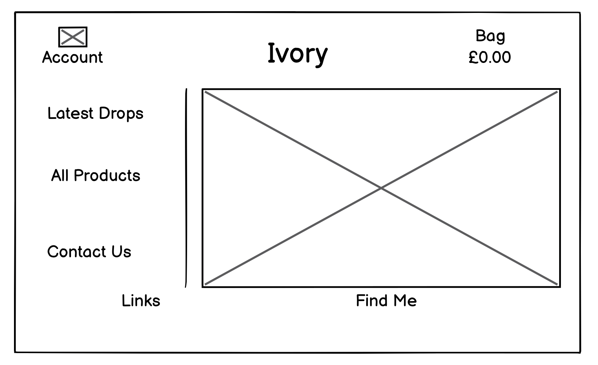
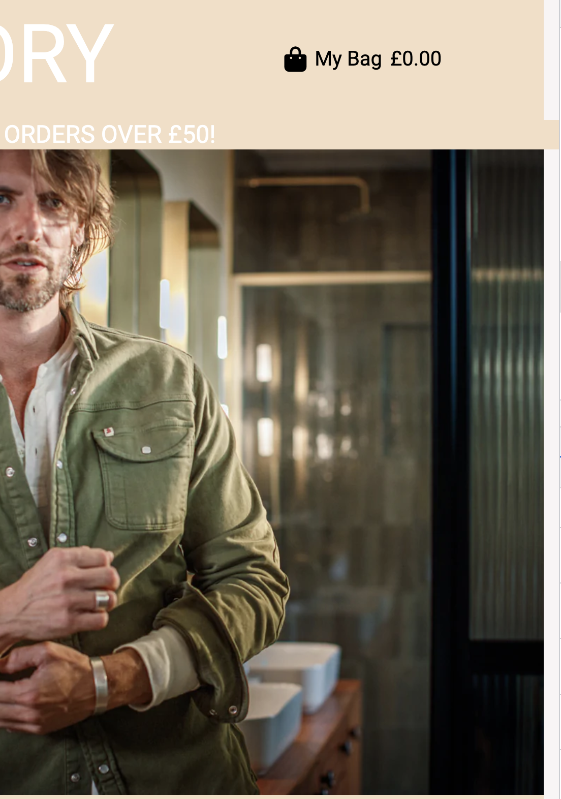
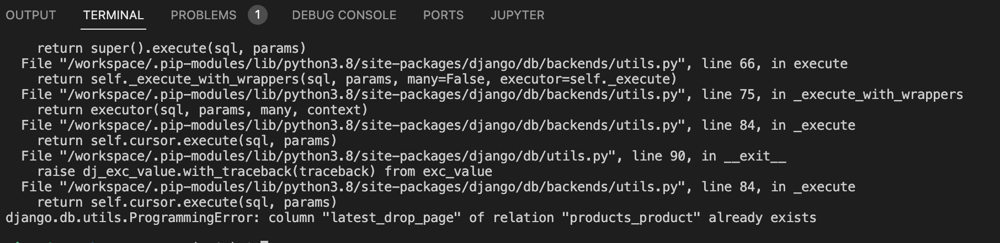
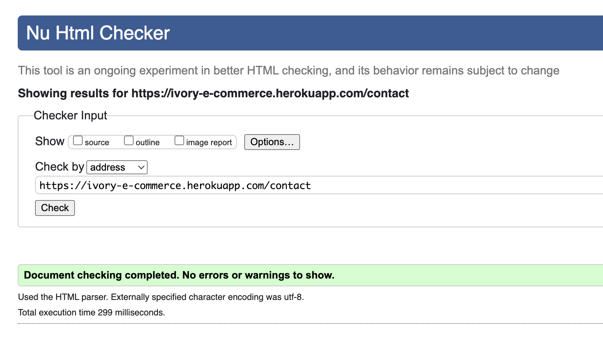
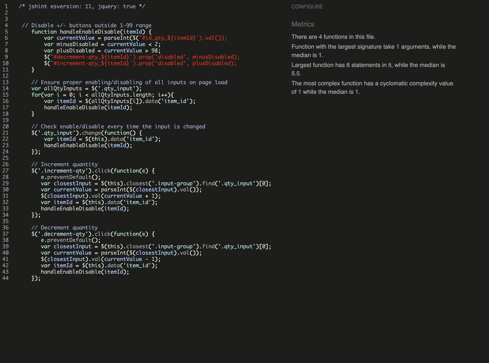

# Universal Blogs

## Introduction

Ivory is a modern clothing brand that is selling there stock via their online shop.

This website is for educational purposes only, the website is not setup to receive real payments, only fake payments are viable. 
To make a fake payment use the below credit card detials.

* 4242424242424242 (Visa)
* Expiration date = Any future date (Example: 12/24)
* CVN = any 3 digits (Example: 132)
* Postcode = any 5 digits (Example: 12345)

## Preview

### Live Website
To visit the deployed website click [here](https://ivory-e-commerce.herokuapp.com/)

# Table of Contents
- [Table of Contents](#table-of-contents)
- [Introduction](#introduction)
- [UX](#ux-user-experience)
- [Agile Development Process](#agile-development-process)
- [Design](#design)
- [Features](#features)
- [Technologies Used](#technologies-used)
- [Testing](#testing)
- [Deployment](#deployment)
- [Credits](#credits)
- [Acknowledgements](#acknowledgements)

## UX

This website was desgined to have an old fashioned, relic feel to it. The simplicity and use of colors were used to create this.

### Colour Scheme

Explain your colours and the colour scheme.

- `#000` used for primary text.
- `#f4dec5` used for the secondary background color
- `#F8F5F5` used for the main background color

### Typography

I used the Roboto font, via fonts.google.com, becuase it had a basic feel to it which corresponds with the design of the website. This is a popular font thats used in many projects. I also used the bag,profile, linkedin and github icons from font awesome so the page has less text and more images which makes the site easier to navigate.

- [Roboto](https://fonts.google.com/specimen/Montserrat) was used and the boldness varies where appropriate.

- [Font Awesome](https://fontawesome.com) icons were used throughout the site.

### User Stories

### Site Admin/Creator:

### Site User

## Agile Development Process

## Design
### Wireframes

  

### Database Schema

## features 

### navbar

- I have created a simple narbar that has a creamy white theme to it. I have also created a mobile navbar that collapes to show a dropdown menu. The mobile menu replaces the main navbar for small to medium devices only.

### Home Page

- This page displays a model in stylish clothing alongside links to the latest drop page, products page and the contact page.

### Contact Page

- I used a basic boostrap template for the contact form.

### Edit Post

- When an admin is logged in, the links to edit and delete appear on each clothing post. They can change the details here with a click of a button.

### Signup Page

- If the user has already got an account, they can press the login link to be directed to the login page.

### Login Page

- If the user has not created an account, the details they use to log in will not work. Once they have an account they can have a profile.

### Admin Panel

### 404 Error Page

- This page provides a link to direct them back to the website if user gets a  navigational page error.

### Future Features

- Make the stripe payments real instead of fake
- Add a reviews section where users can comment on clothing

### Bugs/Errors encountered during development

* There was an extra excess white space to the right of the screen, to fix this I placed a p-0 so there was no padding on the row the image was on.

* After migrating changes to the database, this error occured, to fix this I deleted the database and created a new one by deleting all mirations and pycache files within the migratations folder. I also reset the database on ElephantSQL.

* On the login and sign up pages, when the user inputted invalid data, the error message would appear and push the html elements down and under under the footer. This was becuase the space within the header and footer had a height of 60vh, this was forcing the height of the page so that the elements could not shift down without going underneath the footer.

## Technologies Used

Languages Used
- [HTML5](https://developer.mozilla.org/en-US/docs/Glossary/HTML5)
- [CSS3](https://developer.mozilla.org/en-US/docs/Web/CSS)
- [JavaScript](https://developer.mozilla.org/en-US/docs/Web/JavaScript)
- [Python](https://www.python.org/)

Frameworks, Libraries & Programs Used

- [amiresponsive](https://ui.dev/amiresponsive) to display the responsive website image on different size devices.
- [Balsamiq](https://balsamiq.com) to create wireframes.
- [Django](https://www.djangoproject.com) is a free open-source Python web framework that follows the model-template-views architectural pattern.
- [Font Awesome](https://fontawesome.com) used to display icons for asthetic purposes
- [Git](https://git-scm.com) is version control software which can be used via the Gitpod terminal to commit and push to GitHub
- [Github](https://github.com) is used to store projects containing code
- [Gitpod](https://www.gitpod.io) is a online IDE linked to the GitHub repository used to write this project
- [Google Chrome Dev tools](https://developer.chrome.com/docs/devtools/) used for debugging code
- [Heroku](https://www.heroku.com) is used to deploy this project. Heroku is a cloud platform as a service supporting several programming languages.
- [JQuery](https://jquery.com/) is a JavaScript library designed to simplify HTML DOM tree traversal and manipulation

## Testing

### The W3C Markup Validator

Home Page

Products Page

Product Page

New Drops Page

Contact Page

Login Page

Signup Page

### CSS Validation

### Python Validation

## Flake8

Flake8 was used because pep8online.com website is down. Migrations errors remain as advised by Code Institute.

### Javascript Validation

Stripe JS

Quantity button

### Browser Compatibility

There are no Compatibility issues that I am aware of.

### Chrome

- Mobile Size

- Desktop Size

### Safari

- Tablet Size

- Tablet Size

### Responsiveness

There are no Responsiveness issues that I am aware of.

- Desktop

- Tablet Size

- Mobile Size

### User Testing

- Users were sent to the website to try and break the website in some way by inputing invalid data where possible.
- They also had tasks to complete which are below
1. Register an account and create a blog post
2. Attempt to edit or delete another users post
3. Edit your own post
4. Delete you own post
5. search for posts that do not exit.

- Feedback from users was a success, however 1 common issue was that the user could not upload their own image. They chose a category image from the selected images available to get round this.

* Could not upload there own image

## Deployment

* Log in to [Heroku](https://id.heroku.com/login) or create an account
* On the main page click New and Create New App
* Note: new app name must be unique
* Next select your region, I chose Europe.
* Click Create App button
* Click in resources and select Heroku Postgres database
* Click Reveal Config Vars and add new config "SECRET_KEY"
* Click Reveal Config Vars and add new config "CLOUDINARY_URL"
* Click Reveal Config Vars and add new config "DISABLE_COLLECTSTATIC = 1"
* The next page is the project’s Deploy Tab. Click on the Settings Tab and scroll down to Config Vars
* Next, go to Buildpack section click Add Buildpack select python and Save Changes
* Scroll to the top of the page and choose the Deploy tab
* Select Github as the deployment method
* Confirm you want to connect to GitHub
* Search for the repository name and click the connect button
* Scroll to the bottom of the deploy page and select the preferred deployment type
* Click either Enable Automatic Deploys for automatic deployment when you push updates to Github
* Create a requirements.txt in the root directory file so Heroku can install the packages needed.
* To update requirements.txt with all package installments type the command in the terminal "pip3 freeze --local > requirements.txt"
* To obtain the Postgres DATABASE_URL from Heroku, navigate to the resources tab in your app, under the title Add-ons search for Heroku Postgres, submit this option. The DATABASE_URL will be added to config bars automatically.
* To obtain a cloudinary key, navigate to your cloudinary accounts details under the Dashboard tab. Add the url to the cloudinary config var.
* In GitPod create a file called env.py in the root directory.
* Import os in the env.py file then type os.environ["WRITE_KEY_HERE"] = "VALUES_GO_HERE"
* Fill in the above line with the "SECRET_KEY", "CLOUDINARY_URL" AND "DATABASE_URL". The values for each key are found in the config vars in Heroku.

### Final Deployment 

* Create a runtime.txt `python-3.8.13`
* Create a Procfile `web: gunicorn heardit.wsgi`
* When development is complete change the debug setting to: `DEBUG = False` in settings.py
* In this project the summernote editor was used so for this to work in Heroku add: `X_FRAME_OPTIONS = SAMEORIGIN `to
   settings.py.
* In Heroku settings, delete the config vars for `DISABLE_COLLECTSTATIC = 1`

### Forking This Project

* Open [GitHub](https://github.com/Ewicks/universal-blogs-project-4)
* Find the 'Fork' button at the top right of the page
* Once you click the button the fork will be in your repository
* Create a requirements.txt in the root directory file so Heroku can install the packages needed.
* To update requirements.txt with all package installments type the command in the terminal "pip3 freeze --local > requirements.txt"

### Cloning This Project

* Clone this project by following the steps:

* Open [GitHub](https://github.com/Ewicks/universal-blogs-project-4)
* You will be provided with three options to choose from, HTTPS, SSH or GitHub CLI, click the clipboard icon in order
to copy the URL
* Once you click the button the fork will be in your repository
* Open a new terminal
* Change the current working directory to the location that you want the cloned directory
* Type 'git clone' and paste the URL copied in step 3
* Press 'Enter' and the project is cloned
* Create a requirements.txt in the root directory file so Heroku can install the packages needed.
* To update requirements.txt with all package installments type the command in the terminal "pip3 freeze --local > requirements.txt"

## Credits

* Code Institute "I think therefore i blog" - Django blog project Walkthrough
* Codemy.com blog post tutorials using django - [Youtube playlist](https://www.youtube.com/playlist?list=PLCC34OHNcOtr025c1kHSPrnP18YPB-NFi)
* W3Schools, youtube clips and stackoverflow resources helped my throughout the project
* [link](https://www.youtube.com/watch?v=h_Uv_9OxA2k) to video for typewriter effect
* Images were taken from [Google Images](https://images.google.com/)

## Acknowledgements
* I used Code Institute's material in the Full Stack Development course.
* W3Schools, youtube clips and stackoverflow resources helped my throughout the project
* Tim - Code Institute mentor

This project is for educational use only and was created for the Code Institute Module.

Created by Ethan Wicks

